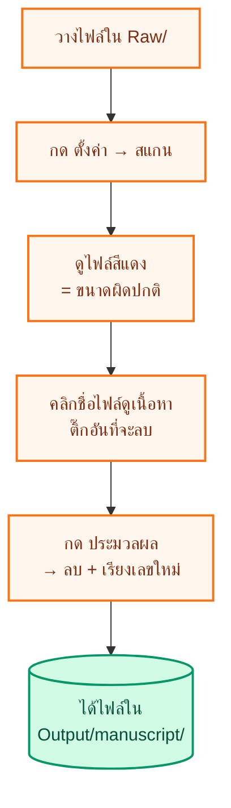
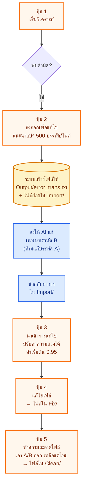

# INKEXTRACT

โปรแกรมช่วยจัดการนิยายแปล — ตรวจไฟล์ คัดคำผิด รวม/แยกตอน ทำพจนานุกรม
ใช้ง่ายผ่านเบราว์เซอร์ ไม่ต้องเขียนโค้ด

---

## สารบัญ

1. [เริ่มต้นใช้งาน](#เริ่มต้นใช้งาน)
2. [โฟลเดอร์ต่าง ๆ — วางไฟล์อะไรที่ไหน](#โฟลเดอร์ต่าง-ๆ--วางไฟล์อะไรที่ไหน)
3. [ขั้นตอนภาพรวม](#ขั้นตอนภาพรวม)
4. [แท็บที่ 1 — โปรเจกต์](#แท็บที่-1--โปรเจกต์)
5. [แท็บที่ 2 — ตรวจต้นฉบับ](#แท็บที่-2--ตรวจต้นฉบับ)
6. [แท็บที่ 3 — คำศัพท์](#แท็บที่-3--คำศัพท์)
7. [แท็บที่ 4 — ตรวจสอบและแก้ไข](#แท็บที่-4--ตรวจสอบและแก้ไข)
8. [แท็บที่ 5 — จัดการไฟล์](#แท็บที่-5--จัดการไฟล์)
9. [แก้ปัญหาที่พบบ่อย](#แก้ปัญหาที่พบบ่อย)

---

## เริ่มต้นใช้งาน

### บนเครื่อง Windows
1. ดาวน์โหลดไฟล์ติดตั้งจาก [หน้าดาวน์โหลด](https://github.com/snibzyz/inkextract/releases/latest) เลือก `INKEXTRACT-windows-x64.zip`
2. คลิกขวาที่ไฟล์ที่ดาวน์โหลดมา → กด **Extract All...** (คลายไฟล์)
3. เข้าโฟลเดอร์ที่คลายแล้ว → ดับเบิลคลิกไฟล์ **`Start.bat`**
4. ถ้ามีแถบเตือนของ Windows → กด **More info** → **Run anyway**
5. รอสักครู่ เบราว์เซอร์จะเปิดให้เอง

### บนเครื่อง Mac
1. ดาวน์โหลดไฟล์ติดตั้งจาก [หน้าดาวน์โหลด](https://github.com/snibzyz/inkextract/releases/latest)
   - เครื่อง Mac รุ่นใหม่ (ชิป M1/M2/M3/M4) เลือก `INKEXTRACT-macos-arm64.zip`
   - เครื่อง Mac รุ่นเก่า (ชิป Intel) เลือก `INKEXTRACT-macos-x64.zip`
2. ดับเบิลคลิกไฟล์ที่ดาวน์โหลดมาเพื่อคลายไฟล์
3. **คลิกขวาที่ `Start.command` → Open → Open** (ทำแบบนี้เฉพาะครั้งแรก)
4. รอสักครู่ เบราว์เซอร์จะเปิดให้เอง

> เมื่อมีเวอร์ชันใหม่ จะมีแถบสีส้มขึ้นด้านบน กดอัปเดตแล้วปิด-เปิดแอปใหม่ได้เลย

---

## โฟลเดอร์ต่าง ๆ — วางไฟล์อะไรที่ไหน

ส่วนสำคัญที่สุดที่ต้องเข้าใจ — แต่ละโฟลเดอร์มีไว้ทำอะไร

### โฟลเดอร์ที่ "คุณ" ต้องวางไฟล์เอง

| โฟลเดอร์ | วางไฟล์อะไร |
|---|---|
| **`Raw/`** | ไฟล์ต้นฉบับจีน (ยังไม่แปล) |
| **`Input/`** | ไฟล์ที่ AI แปลให้แล้ว (มีจีนสลับไทยทีละบรรทัด — แท็ก `[A]` คือจีน, `[B]` คือไทย) |
| **`Vocab/`** | ไฟล์พจนานุกรมที่จะใช้เทียบคำแปล |
| **`Import/`** | ไฟล์ที่ AI ช่วยแก้คำผิดให้แล้ว นำกลับมาวางตรงนี้ |

### โฟลเดอร์ที่ "ระบบ" สร้างให้อัตโนมัติ

| โฟลเดอร์ | ระบบใส่อะไรให้ |
|---|---|
| **`Output/`** | รายการคำผิดที่ต้องแก้ + ไฟล์พจนานุกรม + รายงานต่าง ๆ |
| **`Fix/`** | ไฟล์ที่แก้คำผิดแล้ว (ยังมี `[A]/[B]` อยู่) |
| **`Clean/`** | ไฟล์สะอาด เหลือแต่ภาษาไทย พร้อมส่ง |
| **`Merge/`** | ไฟล์ที่รวมหลายตอนเข้าด้วยกัน |
| **`Separate/`** | ไฟล์ที่แยกตอนจากไฟล์ใหญ่ |
| **`Finish/`** | ฉบับที่เผยแพร่แล้ว (ย้ายมาเก็บเอง) |

### โฟลเดอร์อยู่ตรงไหนบนเครื่อง

```
INKEXTRACT/
├── workspace/                    ← โปรเจกต์เริ่มต้น (ใช้ได้เลย)
│   ├── Raw/, Input/, Fix/, Clean/, ...
│
├── projects/                     ← โปรเจกต์ที่สร้างเพิ่ม
│   ├── ติดหนี้สามสิบล้าน/
│   └── นิยายอีกเรื่อง/
│
└── .config/                      ← ไฟล์ตั้งค่าของแอป (ไม่ต้องแตะ)
```

---

## ขั้นตอนภาพรวม

ดูภาพรวมว่างานจากต้นจนจบเป็นอย่างไร — ใช้เวลา 1 นาทีอ่าน

```mermaid
flowchart TD
    Start([เริ่มต้น]) --> P1[สร้างโปรเจกต์ใหม่<br/>แท็บ โปรเจกต์]
    P1 --> P2[วางไฟล์ลง 2 โฟลเดอร์]
    P2 --> Raw[("Raw/<br/>จีนต้นฉบับ")]
    P2 --> Input[("Input/<br/>AI แปลให้แล้ว")]

    Raw --> Opt1{ไม่บังคับ}
    Input --> Opt1
    Opt1 --> Manu[แท็บ ตรวจต้นฉบับ<br/>หาไฟล์ที่หาย/สั้นผิดปกติ]
    Manu --> Vocab[แท็บ คำศัพท์<br/>รวมพจนานุกรม ตัดซ้ำ]

    Vocab --> Analyze[แท็บ ตรวจสอบและแก้ไข<br/>กด เริ่มวิเคราะห์]
    Analyze --> Export[กด ส่งออกเพื่อแก้ไข]
    Export --> Files[("Output/error_trans.txt<br/>+ ไฟล์ย่อยใน Import/")]

    Files --> AI[นำไปให้ AI ช่วยแก้<br/>แก้บรรทัด B เท่านั้น]
    AI --> Place[นำกลับมาวางใน Import/]
    Place --> Imp[กด นำเข้าการแก้ไข]
    Imp --> Fix[กด แก้ไขไฟล์<br/>→ ไฟล์ออกใน Fix/]
    Fix --> CleanBtn[กด ทำความสะอาดไฟล์<br/>→ ไฟล์ออกใน Clean/]
    CleanBtn --> Done([ได้ไฟล์สะอาดพร้อมส่ง])
    Done --> Extra[เลือกใช้แท็บ จัดการไฟล์<br/>รวมตอน/แปลงเป็นไฟล์เวิร์ด]

    classDef userAction fill:#fff7ed,stroke:#f97316,stroke-width:2px,color:#7c2d12
    classDef systemFile fill:#fef3c7,stroke:#d97706,stroke-width:2px,color:#78350f
    classDef folder fill:#dbeafe,stroke:#2563eb,stroke-width:2px,color:#1e3a8a
    classDef done fill:#d1fae5,stroke:#059669,stroke-width:2px,color:#064e3b

    class P1,P2,AI,Place,Manu,Vocab,Analyze,Export,Imp,Fix,CleanBtn userAction
    class Files systemFile
    class Raw,Input folder
    class Done,Extra done
```



> สีส้ม = คุณทำเอง · สีฟ้า = โฟลเดอร์ · สีเหลือง = ระบบสร้างไฟล์ให้ · สีเขียว = เสร็จ

---

## แท็บที่ 1 — โปรเจกต์

**ใช้ทำอะไร**: แยกงานแต่ละเรื่องออกจากกัน ไฟล์จะไม่ปนกัน

### ทำอะไรได้บ้าง

- **ดูว่าตอนนี้ทำงานอยู่ในโปรเจกต์ไหน** — มีแถบส้มบอกด้านบนเสมอ
- **กด "เปิดโฟลเดอร์"** — เปิดโฟลเดอร์ของโปรเจกต์นั้นในตัวจัดการไฟล์ของเครื่อง
- **ขยายดู "โฟลเดอร์ย่อยของโปรเจกต์"** — เช็คว่ามีไฟล์กี่อันในแต่ละโฟลเดอร์
- **สลับโปรเจกต์** — กด "สลับไป" ที่โปรเจกต์ที่ต้องการ
- **สร้างใหม่** — กรอกชื่อ (ภาษาไทย/อังกฤษ/จีนได้) → กด "สร้างและสลับไปใช้งาน"
- **เปลี่ยนชื่อ / ลบ** — ทำได้เฉพาะโปรเจกต์ที่สร้างเอง (โปรเจกต์เริ่มต้นลบไม่ได้)

ตอนลบโปรเจกต์ มีตัวเลือก "ลบโฟลเดอร์และไฟล์ทั้งหมดด้วย" — ถ้าไม่ติ๊ก ไฟล์ยังอยู่บนเครื่อง แค่ไม่อยู่ในรายการของแอป

### ขั้นตอนใช้งาน


---

## แท็บที่ 2 — ตรวจต้นฉบับ

**ใช้ทำอะไร**: หาไฟล์ที่ขนาดเล็กผิดปกติ (น่าจะดาวน์โหลดมาไม่ครบ/ตอนสั้นเกิน) แล้วช่วยลบและเรียงเลขตอนใหม่

**ใช้กับโฟลเดอร์ไหน**: ค่าเริ่มต้นชี้ที่ **`Raw/`** แต่ระบุโฟลเดอร์อื่นก็ได้

### หน้าจอเป็นแบบ 2 ฝั่ง

**ฝั่งซ้าย** — รายการไฟล์ทั้งหมด
- ติ๊กช่องสี่เหลี่ยม = เลือกไฟล์ไว้ลบ
- คลิกชื่อไฟล์ = ดูเนื้อหา (แค่ดูเฉย ๆ ไม่ได้เลือกลบ)
- ไฟล์ที่เล็กผิดปกติ จะเป็นสีแดงให้สังเกตได้ทันที
- มีช่องค้นหาชื่อไฟล์

**ฝั่งขวา** — เนื้อหาของไฟล์ที่กำลังดู
- แสดงพร้อมเลขบรรทัด
- ปุ่มลูกศร ▲ ▼ กระโดดไปไฟล์เล็กถัดไป/ก่อนหน้า

### ปุ่มที่ใช้

| ปุ่ม | ทำอะไร |
|---|---|
| **ตั้งค่า** | เริ่มสแกนไฟล์ในโฟลเดอร์ |
| **เปิด** | เปิดโฟลเดอร์ในตัวจัดการไฟล์ |
| **โหลดใหม่** | สแกนใหม่ |
| **เลือกไฟล์ขนาดเล็ก** | ติ๊กเฉพาะไฟล์ที่เป็นสีแดง |
| **เลือกทั้งหมด / ยกเลิกทั้งหมด** | ติ๊ก/ยกเลิกทุกไฟล์ |
| **ประมวลผล** | ลบไฟล์ที่ติ๊ก + เรียงเลขตอนใหม่ (ของเดิมยังถูกสำรองไว้) |

มีแถบเลื่อนตั้งเกณฑ์ — ค่า 30% หมายถึงไฟล์ที่เล็กกว่า 30% ของขนาดเฉลี่ยจะถูกทำสีแดง

ผลลัพธ์จะถูกบันทึกในโฟลเดอร์ `Output/manuscript/` (ของเดิมที่ลบไม่ได้หายไป — เก็บไว้เผื่อพลาด)

### ขั้นตอนใช้งาน



---

## แท็บที่ 3 — คำศัพท์

**ใช้ทำอะไร**: รวมไฟล์พจนานุกรมหลายไฟล์เข้าด้วยกัน ตัดคำซ้ำ หาคำที่แปลขัดแย้งกัน ทำเป็นไฟล์เดียวสะอาด ๆ

**วางไฟล์ที่ไหน**: ลากวางในแอปได้เลย (ไม่ต้องวางในโฟลเดอร์ก่อน) รองรับไฟล์นามสกุล `.txt` `.csv` `.tsv` `.xlsx`

### รูปแบบไฟล์ที่อ่านได้

```
不朽 [แท็บ] อมตะ
修炼境界 | ขอบเขตการบำเพ็ญ
圣者 | นักบุญ | หมายเหตุ
```

ผสมรูปแบบในไฟล์เดียวกันได้ ระบบจะตรวจให้

### 4 ขั้นตอน

**1. อัปโหลดไฟล์** — ลากวางไฟล์ลงในช่อง

**2. ดูภาพรวม** — มีการ์ดสรุปทันที 4 ใบ
- บรรทัดทั้งหมด
- คู่ไม่ซ้ำ (จีน+ไทย ที่ไม่ซ้ำกัน = จำนวนคำจริง)
- บรรทัดซ้ำเป๊ะ (มีคู่จีน+ไทย เหมือนกันหลายบรรทัด)
- คำขัดแย้ง (จีนตัวเดียวกัน แต่แปลไทยไม่เหมือนกัน — ต้องเลือก)

**3. เลือกแม่แบบสำเร็จรูป หรือปรับเอง**

แม่แบบ 4 ตัว — กดปุ่มเดียวจบ:
| แม่แบบ | ใช้ตอนไหน |
|---|---|
| **พจนานุกรม (เริ่มต้น)** | อยากได้ไฟล์สะอาด ตัดซ้ำ ลบหมายเหตุ |
| **รีวิวคำขัดแย้ง** | เห็นเฉพาะคำที่แปลไทยไม่ตรงกัน เพื่อมารีวิว |
| **ดูคำซ้ำเป๊ะ** | เห็นเฉพาะที่ซ้ำตั้งแต่ 2 ครั้งขึ้นไป |
| **คำที่ใช้บ่อย** | เก็บเฉพาะคำที่เจอตั้งแต่ 3 ครั้งขึ้นไป |

หรือกด "ปรับแต่งเอง" เพื่อเลือกเงื่อนไขเพิ่ม:
- เก็บเฉพาะคำที่เจอกี่ครั้ง (เช่น 3-100 ครั้ง)
- เก็บเฉพาะคำจีนที่ยาวกี่ตัว
- ค้นหาคำเฉพาะ
- เลือกเฉพาะจากบางไฟล์
- จำกัดจำนวนบรรทัด

และเลือก **การเรียง** (ตามเดิม / ยาว→สั้น / สั้น→ยาว / ตามอักษร / ตามความถี่ / จัดกลุ่ม)

**4. กด "สร้างไฟล์"** — เห็นจำนวนบรรทัดที่จะได้ก่อน แล้วกดสร้าง → ได้ไฟล์ในโฟลเดอร์ `Output/`

ถ้าจะใช้ไฟล์นี้ตอนตรวจคำผิด ให้ย้ายไปวางใน `Vocab/` ของโปรเจกต์ก่อน

### ขั้นตอนใช้งาน


---

## แท็บที่ 4 — ตรวจสอบและแก้ไข

แท็บนี้มี 3 โหมดข้างใน

### 4.1 โหมด AB (โหมดหลัก — ใช้บ่อยที่สุด)

**ใช้ตรวจ**: ไฟล์ที่มี `[A]` (จีน) สลับกับ `[B]` (ไทย) — ที่ AI แปลให้

**ตรวจหาอะไรได้บ้าง**:
- ภาษาจีน/อังกฤษ/ตัวเลข ที่หลงเหลือในบรรทัดไทย
- คำแปลที่ไม่ตรงกับพจนานุกรม
- บรรทัดที่ AI ข้ามไป ไม่ได้แปล
- เนื้อหาที่ซ้ำกันระหว่างไฟล์

**วางไฟล์ที่ไหน**:
- ไฟล์ที่ AI แปลแล้ว → `Input/`
- ไฟล์จีนต้นฉบับ (ถ้าจะตรวจว่า AI ข้ามแปลตรงไหน) → `Raw/`
- ไฟล์พจนานุกรม → `Vocab/`

#### ตัวเลือกการตรวจ (ติ๊กเปิด/ปิดได้)

| ตัวเลือก | ความหมาย |
|---|---|
| ตรวจสอบภาษาต่างประเทศ | หาตัวอักษรที่ไม่ใช่ไทยในบรรทัดไทย |
| ตรวจสอบตัวเลข | หาตัวเลขในบรรทัดไทย |
| ตรวจสอบภาษาอังกฤษ | หาตัวอักษรอังกฤษในบรรทัดไทย |
| ตรวจเนื้อหาซ้ำระหว่างไฟล์ | เตือนถ้ามีบรรทัดไทยเหมือนกันเป๊ะหลายไฟล์ |
| ตรวจคำแปลไทยเทียบกับพจนานุกรม | ถ้าจีนใน `[A]` ตรงกับพจนานุกรม → ดูว่าไทยใน `[B]` แปลตามไหม |
| ตรวจหาบรรทัดที่ AI ข้ามแปล | เทียบกับไฟล์จีนต้นฉบับ หาบรรทัดที่ AI แปลตกหล่น |

มีแถบเลื่อน "ระดับความเข้มงวด" สำหรับการเทียบกับไฟล์จีนต้นฉบับ:
- ตั้งสูง = เข้มงวด → จับว่า "ข้ามแปล" ได้เยอะ (อาจเกินจริง)
- ตั้งต่ำ = ผ่อนปรน → ยอมรับว่า AI แปลแบบเรียบเรียงใหม่ได้ จับน้อยลง

#### กล่อง "การตั้งค่ารูปแบบยกเว้น"

ขยายดูเพื่อเพิ่มอักขระที่ไม่ต้องการให้นับเป็นข้อผิดพลาด เช่น 【, 】, เลขโรมัน — แก้เสร็จแล้วกด "บันทึก" + "โหลดรูปแบบใหม่"

#### ปุ่มหลัก 5 ปุ่ม — ใช้ตามลำดับ



#### ไฟล์ที่ระบบสร้างให้

- `Output/error_trans.txt` — รายการคำผิดทั้งหมด (ฉบับเต็ม)
- `Output/error_trans_001.txt`, `_002.txt`, ... — ไฟล์ที่แบ่งเป็นชิ้นเล็ก (ถ้าตั้งให้แบ่ง)
- `Import/import_errors.txt` — สำเนาให้แก้ในนี้ได้เลย (ไม่ต้องไปที่ Output)

> **กฎสำคัญ**: ระบบจะไม่ตัดข้อความกลางคันแน่นอน — จะแบ่งระหว่างจุดที่จบของแต่ละรายการเสมอ และทุกไฟล์เล็กจะมีหัวกำกับว่า "ส่วนที่ X จาก Y"

---

### 4.2 โหมดทั่วไป

**ใช้ตรวจ**: ไฟล์ที่ไม่มี `[A]/[B]` แล้ว — เช่น ตรวจซ้ำหลังทำสะอาด

**เลือกโฟลเดอร์ได้**:
- **Clean (แนะนำ)** — ตรวจไฟล์ที่ทำสะอาดแล้ว
- **Input** หรือ **Fix** — ตามต้องการ
- **ระบุเส้นทางเอง** — ใส่ที่อยู่โฟลเดอร์เอง

#### ตัวเลือกการตรวจ
- ตรวจสอบภาษาต่างประเทศ
- ตรวจสอบตัวเลข
- ตรวจสอบภาษาอังกฤษ

กด "วิเคราะห์โหมดทั่วไป" → เห็นการ์ดสถิติ + ตารางบรรทัดที่เจอ → ดาวน์โหลดผลเป็นไฟล์ตารางได้

---

### 4.3 ตรวจหลายโฟลเดอร์

**ใช้ตรวจ**: หลายโฟลเดอร์พร้อมกัน — เหมาะกับงานที่แยกตามเรื่อง/นักแปล

รองรับโครงสร้าง 2 แบบ:

**แบบที่ 1** — แยกตามเรื่อง (ชั้นเดียว)
```
Input/
├── เรื่อง1/
│   ├── ตอน001.txt
│   └── ตอน002.txt
└── เรื่อง2/
    └── ตอน001.txt
```

**แบบที่ 2** — แยกตามนักแปล แล้วซ้อนตามเรื่อง
```
Input/
├── นักแปล1/
│   └── เรื่อง1/
│       └── ตอน001.txt
└── นักแปล2/
    └── เรื่อง2/
        └── ตอน001.txt
```

กด "วิเคราะห์หลายโฟลเดอร์" → เห็นตารางสรุปทุกโฟลเดอร์

กด "บันทึกผลและเปลี่ยนชื่อโฟลเดอร์":
- โฟลเดอร์ที่มีคำผิด → เพิ่ม **`w`** หน้าชื่อ (ยังต้องแก้)
- โฟลเดอร์ที่ผ่าน → เพิ่ม **`c`** หน้าชื่อ (สะอาดแล้ว)

มองชื่อโฟลเดอร์ก็รู้ทันทีว่าอันไหนเสร็จแล้ว อันไหนยังต้องแก้

---

## แท็บที่ 5 — จัดการไฟล์

แท็บนี้มี 6 ฟังก์ชันย่อย

### 5.1 รวมไฟล์

**ใช้ทำอะไร**: รวมไฟล์ตอน (เช่น `Chapter 001.txt`, `Chapter 002.txt`, ...) เป็นไฟล์ใหญ่ — รวมทั้งหมดเป็นไฟล์เดียว หรือแบ่งกลุ่ม (เช่น 5 ตอนต่อไฟล์)

**เลือกโฟลเดอร์ต้นทาง**: Clean (แนะนำ) / Fix / Output / กำหนดเอง

**โฟลเดอร์ปลายทาง**: `Merge/` (หรือกำหนดเอง)

**ตั้งค่าได้**:
- ตอนต่อไฟล์ (0 = รวมหมดเป็นไฟล์เดียว)
- ชื่อไฟล์: คำนำหน้า + เลข + คำต่อท้าย (เช่น `Chapter 001.txt`)
- จำนวนหลักของเลข (เช่น 001 หรือ 0001)
- เลขเริ่มต้น
- คำท้ายตอน (เช่น "จบตอน")
- ตัวเลือกเพิ่มหัวข้อบทใหม่ในไฟล์รวม

มีตัวอย่างชื่อไฟล์ + จำนวนไฟล์ที่จะได้ ให้ดูก่อนกดรวมจริง

### 5.2 แยกไฟล์

**ใช้ทำอะไร**: ตัดไฟล์ใหญ่ที่มีหลายตอนรวมกัน → เป็นไฟล์ตอนแยก ๆ

**วางไฟล์ที่ไหน**: ลากวางในแอป (รับไฟล์นามสกุล `.txt`)

**ตั้งค่าได้**:
- ตัวแบ่งระหว่างตอน (เช่น `###` หรือคำว่า `Chapter`)
- รูปแบบชื่อไฟล์ปลายทาง
- ลบคำท้ายตอน (เช่น "จบตอน") อัตโนมัติ

### 5.3 สร้างไฟล์

**ใช้ทำอะไร**: สร้างไฟล์เปล่าหลายไฟล์พร้อมกัน เตรียมไว้ใส่เนื้อหาทีหลัง

**ออกที่ไหน**: **`Input/`**

**ตั้งค่าได้**:
- ชื่อไฟล์ (เช่น `Chapter 001.txt` ถึง `Chapter 010.txt`)
- จำนวนไฟล์ที่จะสร้าง
- ใส่ชื่อตอนเป็นบรรทัดแรก (ใช้ชื่อไฟล์ หรือกำหนดเอง)

ไฟล์ที่มีอยู่แล้วจะถูกข้าม ไม่ทับทิ้ง

### 5.4 แปลงไฟล์

แปลงระหว่างไฟล์เวิร์ด (`.docx`), ไฟล์ข้อความ (`.txt`), ไฟล์มาร์กดาวน์ (`.md`)

**มี 3 โหมด**:

| โหมด | ต้นทาง → ปลายทาง | ใช้ตอนไหน |
|---|---|---|
| **เวิร์ด → ข้อความ** | `Input/` → `Output/` | นักแปลส่งไฟล์เวิร์ดมา ต้องการนำเข้าระบบ |
| **ข้อความ ↔ มาร์กดาวน์** | เปลี่ยนนามสกุลใน `Clean/` ที่เดิม | ต้องการเปลี่ยนนามสกุลไปมา |
| **ข้อความ/มาร์กดาวน์ → เวิร์ด** | `Clean/` → `Clean/` (ที่เดิม) | เตรียมไฟล์ส่งให้ผู้อ่านในรูปแบบเวิร์ด |

ทุกโหมดมีสถิติบอกจำนวนไฟล์ก่อนแปลง

### 5.5 ตรวจรูปแบบ

**ใช้ทำอะไร**: เช็คว่าบรรทัดแรกของไฟล์ทั้งหมดใน `Clean/` ขึ้นต้นเหมือนกันไหม (เช่น ทุกไฟล์ขึ้นต้นด้วย "ตอนที่ XXX")

กด "ตรวจสอบรูปแบบ" → ระบบจะบอก:
- ไฟล์ทั้งหมดกี่ไฟล์
- ตรงรูปแบบกี่ไฟล์ (กี่เปอร์เซ็นต์)
- ไม่ตรงกี่ไฟล์
- รูปแบบไหนคือมาตรฐาน (รูปแบบที่พบเกิน 70%)

ไฟล์ที่ผิดรูปแบบจะถูกทำสีเหลืองในตาราง — ส่งออกรายงานเป็นไฟล์เก็บใน `Output/` ได้

### 5.6 ลบไฟล์

**ใช้ทำอะไร**: ลบไฟล์ในโฟลเดอร์ที่เลือก — สำหรับเริ่มงานใหม่หรือเคลียร์งานเก่า

> **ระวัง**: ลบแล้วกู้คืนไม่ได้

แสดงจำนวนไฟล์ในแต่ละโฟลเดอร์ให้เห็นก่อน

**ค่าเริ่มต้น** (ปลอดภัยสำหรับเริ่มรอบใหม่):
| โฟลเดอร์ | ติ๊กไว้แล้ว? |
|---|---|
| Input | ติ๊ก |
| **Raw** | **ไม่ติ๊ก** (ต้นฉบับล้ำค่า) |
| Fix | ติ๊ก |
| Clean | ติ๊ก |
| Merge, Separate, Import | ไม่ติ๊ก |

ติ๊กเลือก → กด "ลบไฟล์ที่เลือก" → ระบบจะถามยืนยันอีกครั้งก่อนลบจริง

---

## แก้ปัญหาที่พบบ่อย

| ปัญหา | วิธีแก้ |
|---|---|
| เปิดโปรแกรมแล้วเบราว์เซอร์ไม่เปิด | รอ 10-20 วินาที เบราว์เซอร์จะเปิดเอง |
| Windows ขึ้นแถบเตือนสีน้ำเงิน | กด **More info** → **Run anyway** |
| Mac บอกว่าเปิดไม่ได้ / damaged | คลิกขวาที่ `Start.command` → Open → Open |
| นำเข้าแล้วจับคู่ไม่ได้ | ลดค่า "ความตรง" ในแถบเลื่อนตอนนำเข้า (เช่นจาก 0.95 → 0.85) |
| ตรวจ AI ข้ามแปลแล้วไม่พบไฟล์จีน | ตรวจว่าไฟล์อยู่ใน `Raw/` และชื่อใกล้เคียงกับไฟล์ใน `Input/` |
| ลบโปรเจกต์ผิด | ถ้าไม่ได้ติ๊ก "ลบโฟลเดอร์ด้วย" ไฟล์ยังอยู่บนเครื่อง |
| ส่งออกแล้วไฟล์รายการคำผิดอยู่ไหน | อยู่ใน `Output/error_trans.txt` (ฉบับเต็ม) และ `Import/import_errors.txt` (สำเนาให้แก้) |

---

## ข้อกำหนดเครื่อง

- ใช้ได้บน Windows 10/11 หรือ Mac (ทั้งรุ่นชิปใหม่และเก่า)
- ไม่ต้องลงโปรแกรมเสริม — มีมาให้พร้อม
- ต้องต่ออินเทอร์เน็ตเฉพาะตอนเช็คอัปเดต (ใช้แบบไม่ต่อเน็ตได้)

---

## ลิขสิทธิ์

MIT — ใช้ได้เสรี
